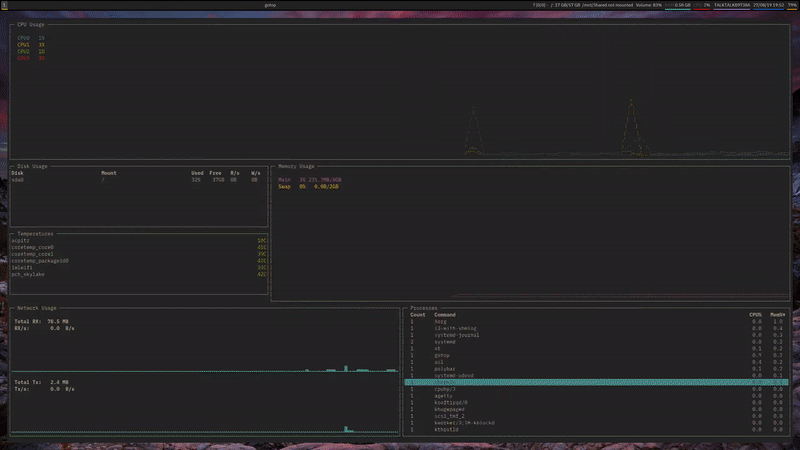

# asl
## The Auto Screen-lapse Tool

### Introduction

asl is a resource-inexpensive way to create timelapses from your screen. It takes screenshots at intervals (`asl`) and uses ffmpeg to convert them into a video (`asl-timelapse`), optionally archiving them

### How to use

Run `asl` at bootup, with a cronjob, Autostart, etc. It will take screenshots at intervals, but if more than a certaing time is between them (i.e. different session), asl will create a new numbered folder. Whenever you want, run `asl-timelapse` to create timelapses.

### Example output

See also `asl-example.webm`

### Todo

 - [X] Install scripts
 - [ ] Configuration in .ini format
 - [X] Make it available on the PyPI
 - [ ] Cross platform - using ffmpeg bindings rather than `os.system()`
 - [ ] Tests, i.e. example pictures
 - [ ] PEP compliance, SLOC limit (for contributors)
 - [ ] Automatic archive zipping 
 - [ ] Timelapse from archive
